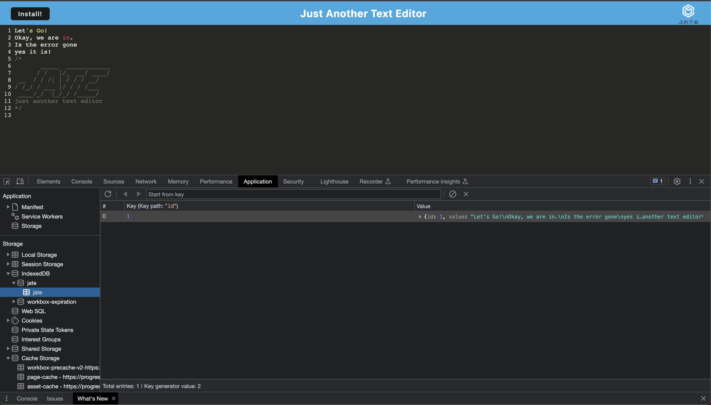

# PWA Text Editor 

## Description 
  As a developer, I want to create notes and code snippets with or without an internet connection so that I can retrieve them for later use.

## Table of Contents
[Installation](#installation) 

[Usage](#usage)

[License](#license)

[Questions](#questions)

## Installation 
  Clone the repository and in the terminal type in the command ```npm i``` to install packages.  Then type ```npm run start``` to start the backend and serve the client.  Navigate to localhost:3000 to view the app locally.  To run the app offline, click the install button to download to your computer.

## Usage 
```
GIVEN a text editor web application
WHEN I open my application in my editor
THEN I should see a client server folder structure
WHEN I run `npm run start` from the root directory
THEN I find that my application should start up the backend and serve the client
WHEN I run the text editor application from my terminal
THEN I find that my JavaScript files have been bundled using webpack
WHEN I run my webpack plugins
THEN I find that I have a generated HTML file, service worker, and a manifest file
WHEN I use next-gen JavaScript in my application
THEN I find that the text editor still functions in the browser without errors
WHEN I open the text editor
THEN I find that IndexedDB has immediately created a database storage
WHEN I enter content and subsequently click off of the DOM window
THEN I find that the content in the text editor has been saved with IndexedDB
WHEN I reopen the text editor after closing it
THEN I find that the content in the text editor has been retrieved from our IndexedDB
WHEN I click on the Install button
THEN I download my web application as an icon on my desktop
WHEN I load my web application
THEN I should have a registered service worker using workbox
WHEN I register a service worker
THEN I should have my static assets pre cached upon loading along with subsequent pages and static assets
WHEN I deploy to Heroku
THEN I should have proper build scripts for a webpack application
```
   


Image shows cached assets


Image shows IndexedDb


Image shows Service Worker


Check out the deployed app here:
https://progressive-text-editor-two-3a84065df07c.herokuapp.com/

## License
  None
  
## Questions
Check out my GitHub at https://github.com/marbfree 

and the repository here:
https://github.com/marbfree/PWA-Text-Editor
